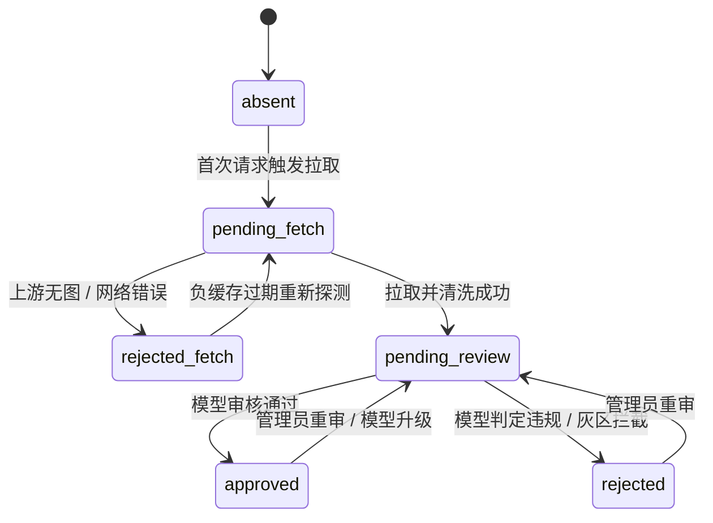

# avater

<p align="center">
  <strong>轻量级自托管 Gravatar 兼容头像代理服务</strong><br>
  内置本地 AI 内容合规审核 · 确定性兜底头像 · 零外部重依赖 · 生产级安全防护
</p>

<p align="center">
  
  
  
  
  
</p>

---

## 目录

- [项目背景与设计理念](#项目背景与设计理念)
- [核心特性](#核心特性)
- [工作原理与状态机](#工作原理与状态机)
- [与 Gravatar 的行为差异](#与-gravatar-的行为差异)
- [快速开始](#快速开始)
  - [方式一：Docker Compose（推荐）](#方式一docker-compose推荐)
  - [方式二：Docker CLI](#方式二docker-cli)
  - [方式三：裸机二进制运行](#方式三裸机二进制运行)
- [接口定义](#接口定义)
  - [公网访问面](#公网访问面)
  - [管理控制面](#管理控制面)
- [安全与隐私清单](#安全与隐私清单)
- [CDN 策略与缓存失效](#cdn-策略与缓存失效)
- [内置默认头像样式](#内置默认头像样式)
- [关键配置速查](#关键配置速查)
- [开发与测试](#开发与测试)
- [开源协议与致谢](#开源协议与致谢)

---

## 项目背景与设计理念

在社区、博客与协作平台中，直接接入 Gravatar 常面临三大痛点：
1. **内容合规风险**：上游用户头像无法预审，容易出现违规或有害图像（NSFW / 暴恐内容）；
2. **海外网络延迟**：回源受制于国际网络链路，容易造成首屏图片加载阻塞；
3. **架构过重**：多数自建代理方案往往引入 Redis、外部队列或重量级模型微服务，部署运维成本高。

**avater** 提供开箱即用的解决方案：
下游只需将头像地址由 `https://secure.gravatar.com/avatar/` 替换为 `https://your-host/avatar/`，即完成零改动接入。

```text
GET /avatar/<md5-or-sha256-hex>?s=80&d=identicon
```

---

## 核心特性

- **Gravatar 原生兼容**：完整支持 MD5 / SHA-256 哈希、尺寸裁剪（`s/size` 1–2048）、强制默认图（`f=y`）、`.jpg/.png` 后缀协商及 HTTP 304 协商缓存。
- **本地 AI 安全审核**：默认集成 SwiftFormer-xs 官方轻量 ONNX 模型（3.5M 参数，CPU 单张推理仅数十毫秒），执行 SFW / NSFW / NSFL 三分类检测；灰区默认保守拒绝，**原图未审绝不外发**。
- **确定性默认头像**：待审核或被拦截时，使用 DiceBear 引擎基于哈希种子实时渲染几何/插画面孔（无生成式 AI），同一哈希跨重启、跨节点输出完全一致。
- **轻量零外部依赖**：元数据使用纯 Go 嵌入式 SQLite（WAL 模式），图片 Blob 存储于本地磁盘；无需 Redis 或外部消息中间件，重启按状态自动断点续扫。
- **生产级深度防御**：
  - **SSRF 拦截**：严格白名单主机、拨号前/拨号后 IP 校验（拦截私网、回环、CGNAT、保留网段）、禁止重定向。
  - **解压缩炸弹防护**：10 MB 体积上限、头信息预检尺寸与像素总数限制，动图仅提取首帧。
  - **数据清洗**：魔数真实性嗅探（忽略上游伪造 Content-Type），解码后重新编码剥离 EXIF 隐私元数据。
- **CDN 友好设计**：支持精确细分的 `Cache-Control` 策略与基于标签的主动失效（支持 Cloudflare `Cache-Tag` 与 Fastly `Surrogate-Key`）。

---

## 工作原理与状态机

### 请求处理流水线

```text
客户端请求 ──► 缓存命中 (Status: approved) ──► 返回处理后的真实头像
                │
                └──► 缓存未命中 (Miss) ──► SingleFlight 去重合并请求
                          │
                          ├──► 从 Gravatar 官方白名单拉取原图
                          ├──► 格式魔数校验 + 尺寸/解炸弹检查 + 剥离 EXIF 重编码
                          ├──► 投递进进程内有界审核队列
                          └──► 本次请求立即返回确定性默认头像 (HTTP 200)

审核通过 (Approved)   ──► 写入本地 Blob 缓存，后续请求直接命中原图
审核拒绝 (Rejected)   ──► 丢弃原图 Blob，永久返回确定性默认头像 (绝不外流违规图)
待审/故障降级 (Pending) ──► 降级返回确定性默认头像，保证服务不中断
```

### 条目状态机



---

## 与 Gravatar 的行为差异

为贯彻安全与隐私第一的设计原则，本服务在部分边界行为上与官方 Gravatar 存在预期内的明确差异：

| 行为场景 | Gravatar 官方 | avater 处理策略 | 设计原因 |
| :--- | :--- | :--- | :--- |
| **上游有图但未完成审核** | 返回官方原图 | 返回本地确定性默认头像（HTTP 200） | 保证未审查内容绝对不会流向公网终端。 |
| **内容被审核系统拒绝** | 返回违规原图 | 永远返回确定性默认头像 | 强阻断机制，被拒条目原图对外永久不可见。 |
| **`d=404` 行为** | 上游无图或无匹配时返回 404 | 仅在上游确认不存在头像（`rejected_fetch`）时返回 404；审核中/拒绝状态依旧返回默认图 | 防止外部利用 404 状态逆向嗅探违规头像的封禁状态。 |
| **自定义 `d=<URL>`** | 允许重定向到外部图片 | **不支持**，未知取值统一回退至本地默认头像 | 消除开放重定向（Open Redirect）与潜在 SSRF 漏洞隐患。 |
| **评级参数 `r=/rating`** | 支持 G/PG/R/X 分级筛选 | **忽略** | 统一通过 AI 严格模型执行 SFW/NSFW 裁决，无需下游手动筛选。 |

---

## 快速开始

### 方式一：Docker Compose（推荐）

创建 `compose.yaml`（或 `docker-compose.yml`）：

```yaml
services:
  avater:
    image: ghcr.io/liueic/avatar:latest
    container_name: avater
    restart: unless-stopped
    ports:
      - "8080:8080"           # 头像服务公开端口
      - "127.0.0.1:8081:8081" # 内部管理端口 (按需映射，切勿暴露公网)
    environment:
      # 镜像已内置模型路径、ONNX 引擎、资源限制等全部预设，仅此一项为必填
      - AVATER_ADMIN_TOKEN=your-secret-token
    volumes:
      - ./data:/data
```

启动服务：
```bash
docker compose up -d
curl -I http://127.0.0.1:8080/avatar/205e460b479e2e5b48aec07710c08d50
```

---

### 方式二：Docker CLI

只需传入唯一必填的环境变量 `AVATER_ADMIN_TOKEN` 即可启动：

```bash
docker run -d --name avater \
  -p 8080:8080 \
  -p 127.0.0.1:8081:8081 \
  -e AVATER_ADMIN_TOKEN=your-secret-token \
  -v $(pwd)/data:/data \
  ghcr.io/liueic/avatar:latest
```

---

### 方式三：裸机二进制运行

**环境要求**：Go $\ge$ 1.25、C 编译器（用于 cgo 链接）。

1. **拉取依赖与构建**：
   ```bash
   make model ort  # 下载 ONNX 模型及对应的 onnxruntime 动态库
   make build      # 编译二进制至 bin/avater
   ```

2. **配置与启动**：
   ```bash
   cp avater.toml.example avater.toml
   # 修改 avater.toml 中的 admin_token，或通过环境变量注入
   export AVATER_ADMIN_TOKEN="your-token"
   ./bin/avater -config avater.toml
   ```

3. **直通调试模式（无模型依赖）**：
   开发环境若无需加载 ONNX，可直接使用直通引擎：
   ```bash
   AVATER_ADMIN_TOKEN=dev-token \
   AVATER_MODERATION_ENGINE=none \
   AVATER_MODERATION_NONE_POLICY=approve \
   make run
   ```

---

## 接口定义

### 公网访问面

公开端口默认为 `:8080`：

| 方法 | 路径 | 说明 |
| :--- | :--- | :--- |
| `GET` | `/` | 服务介绍落地页（静态 HTML，含接入与部署说明） |
| `GET` | `/avatar/{hash}` | 主头像入口（`/{hash}` 同样兼容；`.jpg/.png` 后缀自动剥离） |
| `GET` | `/healthz` | 存活探针（无鉴权，基础状态正常即返回 200） |
| `GET` | `/readyz` | 就绪探针（审核模型加载完毕且引擎就绪时返回 200，否则 503） |
| `GET` | `/metrics` | Prometheus 文本格式监控指标（需配置 `metrics.enabled = true`） |

---

### 管理控制面

管理端口默认为 `127.0.0.1:8081`，所有请求需携带请求头：  
`Authorization: Bearer <AVATER_ADMIN_TOKEN>`

| 方法 | 路由 | 说明与主要参数 |
| :--- | :--- | :--- |
| `GET` | `/admin/stats` | 获取各类状态条目统计数（approved、rejected 等） |
| `GET` | `/admin/entries` | 分页列出条目明细（参数：`status`, `limit`, `cursor`） |
| `POST` | `/admin/entries/{hash}/approve` | 人工标记通过（加锁 `manual_override`；参数 `?force=true`） |
| `POST` | `/admin/entries/{hash}/reject` | 人工拦截拒绝（加锁 `manual_override`；参数 `?force=true`） |
| `POST` | `/admin/entries/{hash}/remoderate` | 重新投递单张头像至审核队列（参数 `?force=true`） |
| `POST` | `/admin/remoderate` | 批量重新审核（参数：`model_ver`, `status`） |
| `DELETE`| `/admin/entries/{hash}` | 删除头像元数据及物理 Blob 文件 |
| `POST` | `/admin/purge` | 触发本地过期缓存清理（参数：`status=expired\|all`） |
| `GET` | `/admin/health` | 查询审核引擎详情（模型版本、ORT 版本、最后推理时间） |

---

## 安全与隐私清单

- **SSRF 深度拦截**：
  - 域名严格相等匹配白名单（`secure.gravatar.com`、`www.gravatar.com` 等）；
  - DNS 解析逐一检验所有返回 IP，阻断 Loopback、私网（RFC 1918）、CGNAT、Link-Local（含云元数据 `169.254.169.254`）、ULA 及保留网段；
  - 建立连接时锁定检验过的安全 IP，严格禁止跟踪 HTTP 30x 重定向。
- **解压炸弹防御**：
  - 上游响应体硬性上限 10 MB；
  - 解码前先使用 `image.DecodeConfig` 获取元信息，尺寸超过 2048 或总像素超过 400 万时直接中断并标记拒绝；
  - 动态 GIF / WebP 仅提取首帧，杜绝逐帧解码膨胀内存。
- **Payload 清洗**：
  - 基于文件头魔数识别类型，拒绝伪装脚本的可疑图片；
  - 全量解码后重新编码（JPEG 质量 85 / PNG 归一化），剔除隐写、EXIF 地理位置及潜在恶意 Chunk。
- **隐私合规**：
  - 系统全流程不感知用户原始邮箱明文，仅处理哈希值；
  - 日志严格实施白名单字段打点（仅记录 hash / status / latency / verdict），默认不持久化客户端 IP。

---

## CDN 策略与缓存失效

源站针对不同处理结果输出精准的缓存响应头，适配各级 CDN 边缘缓存：

| 响应内容 | 默认 Cache-Control 策略 | 设计说明 |
| :--- | :--- | :--- |
| **已通过审核原图** | `public, max-age=86400, s-maxage=604800, stale-while-revalidate=86400, stale-if-error=604800` | 边缘节点长缓存 7 天；不使用 `immutable`，以便后续支持重审撤回。 |
| **显式默认图 (`f=y` / `d=`)** | `public, max-age=2592000, immutable` | 哈希与参数完全确定，永久不可变，极大减轻源站负载。 |
| **待审核 / 已拒绝** | `public, max-age=60, s-maxage=300` | 极短缓存时间，确保审核通过后浏览器与 CDN 能及时回源换回原图。 |
| **上游无图 (404)** | `public, max-age=300` | 负缓存防穿透。 |
| **限流 (429) / 错误 / 管理面** | `no-store` | 禁止中间节点缓存错误状态。 |

### 标签失效（Cache-Tag Purge）

每个头像响应均携带标头：  
- **Cloudflare**：`Cache-Tag: av-<hash>`  
- **Fastly**：`Surrogate-Key: av-<hash>`  

当管理后台发生人工 Approve/Reject、批量重审或条目删除时，系统会自动向已配置的 CDN 异步推送 Tag Purge 请求，实现毫秒级内容撤回。

---

## 内置默认头像样式

系统预置 5 种基于 DiceBear 的矢量渲染样式。全部属于 **CC0 1.0（公有领域）**，可商用且无需声明署名：

| 样式名称 | 风格特征 | 协议默认映射 |
| :--- | :--- | :--- |
| `thumbs` | 橙色/蓝色手势小人表情（活力可爱） | 默认样式 & 未知 `d=` 参数兜底 |
| `lorelei` | 精致插画面孔风格 | `d=retro` 参数默认映射 |
| `identicon` | 经典对称几何网格方块 | `d=identicon` 参数固定映射 |
| `pixel-art` | 经典 8-bit 复古像素风 | 可选（配置 `default_avatar.style` 启用） |
| `open-peeps` | 涂鸦手绘人物形象 | 可选（配置 `default_avatar.style` 启用） |

---

## 关键配置速查

支持 TOML 配置文件及全量环境变量覆盖（环境变量形如 `AVATER_<SECTION>_<KEY>`，优先级更高）：

```toml
listen       = ":8080"            # 公网服务监听地址
admin_listen = "127.0.0.1:8081"   # 管理服务监听地址 (严禁暴露公网)
admin_token  = "change-me"        # 管理面 Bearer Token (必填)

[upstream]
allowed_hosts  = ["secure.gravatar.com", "www.gravatar.com"]
max_bytes      = 10485760         # 上游响应大小上限 (10 MB)
rate_limit_rps = 10               # 对 Gravatar 回源的令牌桶速率上限

[moderation]
engine              = "onnx"      # 审核引擎: onnx | none
model_path          = "models/image-safety-classifier-xs.onnx"
workers             = 1           # 推理并发 Worker 数量 (推荐 1–2)
threshold_nsfw      = 0.5         # NSFW 拦截阈值
threshold_nsfl      = 0.5         # NSFL 拦截阈值
gray_zone_action    = "reject"    # 灰区策略: reject (宁严勿宽) | approve

[cache]
dir                 = "data"      # 数据与 Blob 存储目录
max_bytes           = 1073741824  # 缓存最大容量 (1 GB)，超限按 LRU 淘汰
ttl_approved        = "720h"      # 审核通过原图生命周期 (30 天，命中自动刷新)

[cdn]
provider            = "none"      # none | cloudflare | fastly
cache_tag           = true        # 启用 Cache-Tag 标头
```

完整配置项定义详见 [avater.toml.example](avater.toml.example)。

---

## 开发与测试

```bash
# 运行单元测试、集成测试与竞态排查
make test

# 代码静态检查
make vet

# 下载本地测试所需的 ONNX 模型与动态链接库
make model ort
```

> **提示**：ONNX 运行时库与模型文件仅在运行时按需加载（通过 `dlopen`）；编译阶段无需动态库，使用 `engine=none` 运行时亦无需模型支持。

---

## 开源协议与致谢

- **代码许可**：本项目代码基于 [MIT License](LICENSE) 开源。
- **默认头像**：内置样式源自 [DiceBear](https://www.dicebear.com)（代码遵循 MIT，样式素材为 CC0 1.0）。
- **审核模型**：采用 [OwenElliott/image-safety-classifier-xs](https://huggingface.co/OwenElliott/image-safety-classifier-xs)（MIT 许可）。
